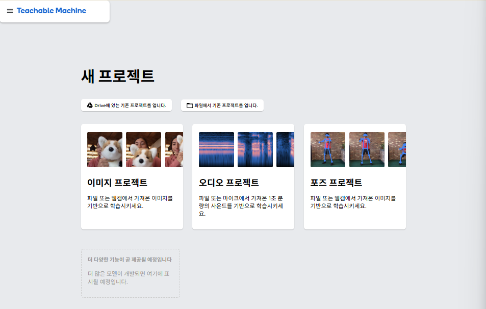
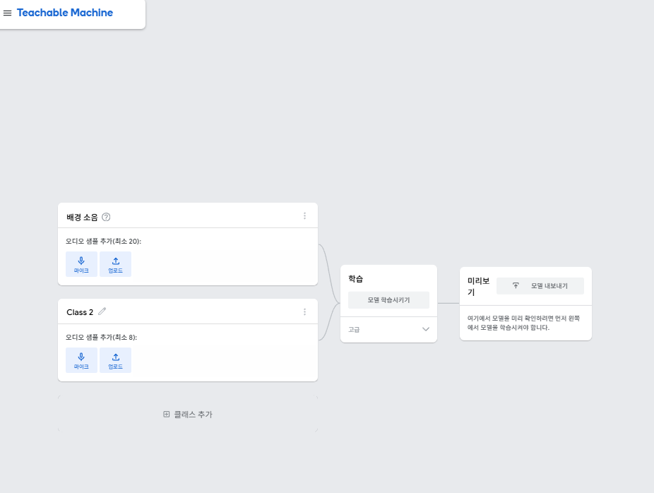
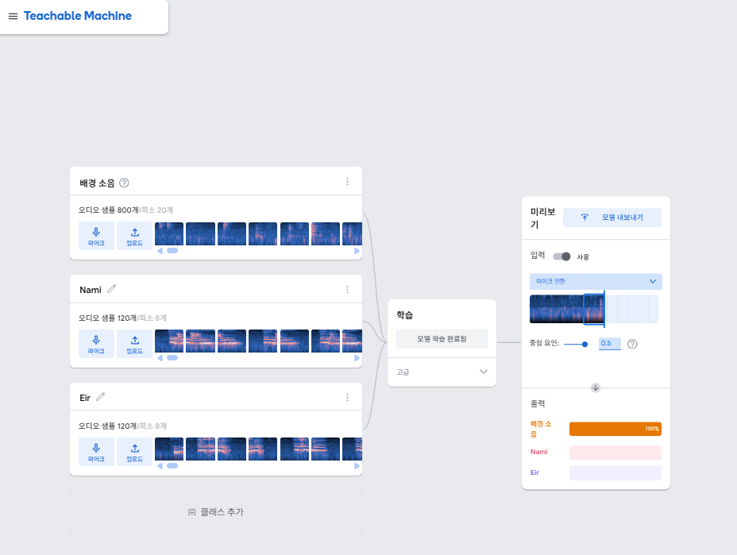
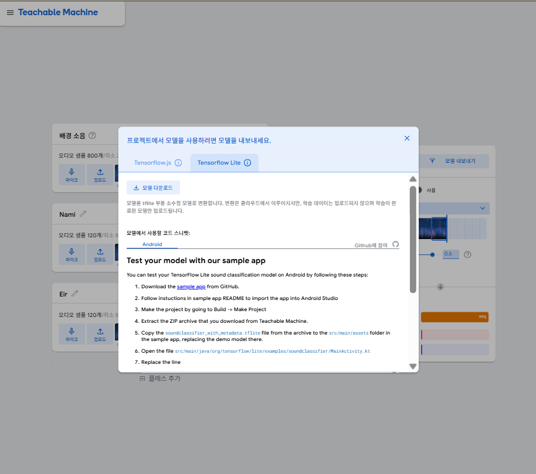

# configs/ - 설정 관련 파일

시스템 전역 설정 (API 키, 모델 선택, 오디오/로그 설정 등)


## 📄 config.py - main 함수 실행을 위한 인수 설정

### 🔧 주요 설정 항목

#### 모델 선택
원하는 모델로 변경 가능:
```python
STT_MODEL = "google"   # "whisper" 또는 "google"
LLM_MODEL = "gemini"   # "gpt" 또는 "gemini"
TTS_MODEL = "clova"    # "google" 또는 "clova" 또는 "openai"
INPUT_MODE = "vad"     # "vad" (자동 감지) 또는 "manual" (엔터키) 또는 "wakeword" (호출어)
```
---
#### API 키 설정
##### STT - Google Cloud Speech-to-Text
Google Cloud 콘솔에서 서비스 계정 JSON 키 발급 필요:
```python
GOOGLE_KEY_PATH = "configs/gen-lang-client-xxx.json"
```
키 발급 방법: [Google Cloud STT 설정 가이드](https://letthegamesbegin7.tistory.com/7)

##### STT - Whisper (OpenAI)
OpenAI 플랫폼에서 API 키 발급 (GPT와 동일한 키 사용):
```python
OPENAI_API_KEY = "sk-proj-..."
```
키 발급 방법: [OpenAI API 키 발급 가이드](https://herojoon-dev.tistory.com/247)

##### LLM - Gemini API
Google AI Studio에서 API 키 발급:
```python
GEMINI_API_KEY = "your-gemini-api-key"
```
키 발급 방법: [Gemini API 키 발급 가이드](https://languagestory.tistory.com/315)

##### LLM - OpenAI GPT
Whisper와 동일한 OpenAI API 키 사용:
```python
OPENAI_API_KEY = "sk-proj-..."
```


##### TTS - Clova Voice
네이버 클라우드 플랫폼에서 Client ID/Secret 발급:
```python
CLOVA_CLIENT_ID = "your-client-id"
CLOVA_CLIENT_SECRET = "your-client-secret"
```
키 발급 방법: [Clova API 키 발급 가이드](https://api.ncloud-docs.com/docs/ai-naver-clovavoice)

**참고**: "Clova Studio"는 별도의 생성형 AI 서비스이며, 음성 합성과는 다른 서비스입니다.

##### TTS - gTTS (무료)
별도 API 키 불필요. 패키지 설치만 필요:
```bash
pip3 install gTTS #또는 pip install gTTS
```
---
#### Wake Word 설정
Teachable Machine으로 학습한 모델 사용:
```python
WAKE_WORD_ENABLED = True
WAKE_WORD_MODEL_PATH = "models/NamiEir.tflite"
WAKE_WORD_TARGETS = [1]  # 감지할 wake word 인덱스; 0: Nami, 1: Eir 
WAKE_WORD_THRESHOLD = 0.55  # 감지 민감도; 0.3~0.7 권장 (높을수록 정확도 ↑, 감지율 ↓)
WAKE_WORD_TIMEOUT: 대기 시간 제한 (None=무제한)
```
##### Wake Word 민감도 조정
Debug 모드로 신뢰도 값을 확인 가능
```python
# 오감지 많을 때 → 임계값 증가
WAKE_WORD_THRESHOLD = 0.7

# 감지 안 될 때 → 임계값 감소
WAKE_WORD_THRESHOLD = 0.3
```

##### TFLite 모델 교체 가이드
1. 파일 교체
```bash
models/soundclassifier_with_metadata.tflite  # 새 모델로 교체
```
2. 설정 수정 (configs/config.py)
새 모델의 학습된 클래스에 맞춰 수정:
```python
# Wake Word 모델 경로 (파일명 변경 시)
WAKE_WORD_MODEL_PATH = os.path.join(PROJECT_ROOT, "models", "새파일명.tflite")

# 클래스 이름 매핑 (Teachable Machine 클래스 순서와 동일하게)
WAKE_WORD_NAMES = {
    0: "새단어1",      # 첫 번째 클래스
    1: "새단어2",      # 두 번째 클래스
    2: "Background"   # 배경음
}

# 감지할 클래스 선택
WAKE_WORD_TARGETS = [0]     # "새단어1"만 감지
# WAKE_WORD_TARGETS = [0, 1] # 둘 다 감지
# WAKE_WORD_TARGETS = None   # 전체 감지

# 임계값 조정 (0.3~0.9 권장)
WAKE_WORD_THRESHOLD = 0.7
```
##### Teachable Machine과 TFLite를 활용한 음성인식 모델 만들기
1. [Teachable Machine 사이트](https://teachablemachine.withgoogle.com/train) 접속



2. 오디오 프로젝트 선택



3. 배경 소음(negative)와 학습할 단어 클래스(positive) 설정 및 학습


> positive: 100개 이상 (최소 8개), negative: positive의 약 1.5~2배 (최소 20개)

> 만약 모델이 무거워질 경우, [Google Colab](https://colab.research.google.com/)을 이용하여 학습

4. 학습(Training)을 시작하고 완료되면, 모델 내보내기(Export Model)에서 Tensorflow Lite 선택



5. 모델 다운로드 후, TFLite 모델 교체 가이드에 따라 설정

> 참고 자료: [Teachable Machine과 TFLite를 활용한 음성인식 모델 만들기](https://okdy.tistory.com/entry/Teachable-Machine%EA%B3%BC-TFLite%EB%A5%BC-%ED%99%9C%EC%9A%A9%ED%95%9C-%EC%9D%8C%EC%84%B1%EC%9D%B8%EC%8B%9D-%EB%AA%A8%EB%8D%B8-%EB%A7%8C%EB%93%A4%EA%B8%B0)
---
#### VAD (음성 활동 감지) 설정
자동 녹음 시작/중지:
```python
VAD_ENABLED = True
VAD_SILENCE_DURATION = 3.0  # 침묵 지속 시간 (초)
VAD_ENERGY_THRESHOLD = 300  # 음성 에너지 임계값
```
---
#### 로그 설정
디버깅 및 출력 제어:
```python
LOG_LEVEL = "DEBUG"          # DEBUG | INFO | WARNING | ERROR
LOG_USE_EMOJI = True         # 이모지 사용
LOG_USE_COLOR = True         # 터미널 컬러
SUPPRESS_TF_WARNINGS = True  # TensorFlow 경고 숨김
LOG_TO_FILE = True           # 로그 파일 저장 여부
LOG_OUTPUT_DIR = "outputs"   # 로그 출력 디렉토리
SUPPRESS_TF_WARNINGS = True
SUPPRESS_PYGAME_HELLO = True
```
---
#### 오디오 설정
녹음 품질 및 처리 단위:
```python
SAMPLE_RATE = 16000  # 샘플링 레이트 (Hz)
CHUNK_SIZE = 160     # VAD 처리 단위 (10ms)
```
---
#### 파일 경로 설정
출력 파일 저장 위치:
```python
OUTPUT_DIR = "assets"
TTS_OUTPUT_FILE = "tts_output.mp3"
RECORDING_OUTPUT_FILE = "user_voice.wav"
TTS_KEEP_FILES = True  # False 시 재생 후 자동 삭제
```