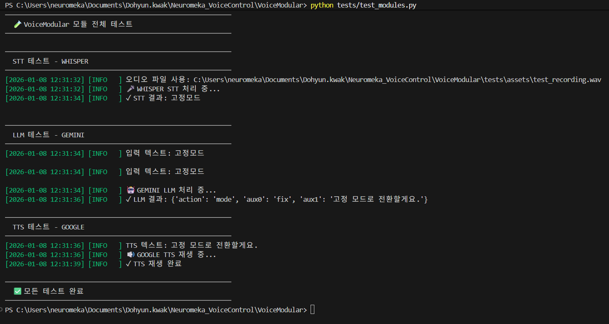
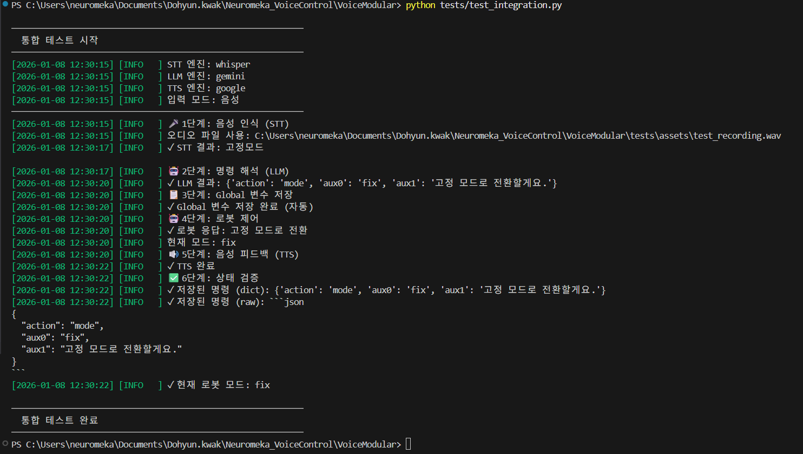

# 🧪 VoiceModular Test Suite

이 폴더는 시스템의 각 모듈이 정상적으로 작동하는지 확인하기 위한
테스트 스크립트를 포함합니다.

## 📋 테스트 전 준비사항
- 마이크와 스피커가 정상적으로 연결되어 있어야 합니다.
- `configs/`에 유효한 API 키가 설정되어 있어야 합니다.
- 프로젝트 루트 또는 tests 폴더 어디서든 실행 가능합니다.

## 🔍 테스트 항목 및 실행 방법

### 1. 개별 모듈 테스트
STT, LLM, TTS 모듈이 외부 API와 정상적으로 통신하는지 확인합니다.
```bash
# 기본 테스트 - STT(Whisper) / LLM(Gemini) / TTS(google)
python test_modules.py

# STT만 테스트
python test_modules.py --module stt --stt whisper

# LLM만 테스트
python test_modules.py --module llm --llm gemini --text "고정"

# TTS만 테스트
python test_modules.py --module tts --tts google --text "안녕하세요"

# 전체 모듈 순차 테스트 (로봇 제어 제외)
python test_modules.py --stt google --llm gpt --tts clova
```


### 2. 전체 통합 테스트 (End-to-End)
음성 입력 → 인식 → 명령 해석 → 로봇 제어 → 음성 피드백까지
전체 파이프라인을 검증합니다.
```bash
# 기본 테스트 - STT(Whipser) / LLM(Gemini) / TTS(Google)
python test_recording.py

# 텍스트 입력 모드 (STT 건너뛰고 LLM부터 시작)
python test_integration.py --text "로봇을 점 고정 모드로 변경해줘"

# 엔진 조합 변경
python test_integration.py --stt google --llm gpt --tts clova

# 텍스트 입력 + 엔진 조합
python test_integration.py --text "선 고정" --stt google --llm gemini --tts clova
```


## 🎯 테스트 시나리오 예시
시나리오 1: STT 엔진 비교
```bash
# 1. 한 번 녹음
python test_recording.py --no-stt

# 2. 같은 파일로 여러 STT 엔진 비교
python test_recording.py --audio tests/assets/test_recording.wav --stt whisper
python test_recording.py --audio tests/assets/test_recording.wav --stt google
python test_recording.py --audio tests/assets/test_recording.wav --stt clova
```

시나리오 2: LLM 프롬프트 검증
```bash
# 다양한 명령 테스트
python tests/test_modules.py --module llm --text "점 고정"
python tests/test_modules.py --module llm --text "선 고정"
python tests/test_modules.py --module llm --text "고정"
python tests/test_modules.py --module llm --text "이동"
```

시나리오 3: 전체 시스템 검증
```bash
python tests/test_integration.py --text "점 고정" --stt google --llm gemini --tts google
```

⚠️ 주의사항
```
테스트 중 생성되는 임시 오디오 파일은 tests/assets/에 저장됩니다.
네트워크 상태에 따라 API 응답 시간이 달라질 수 있습니다.
```