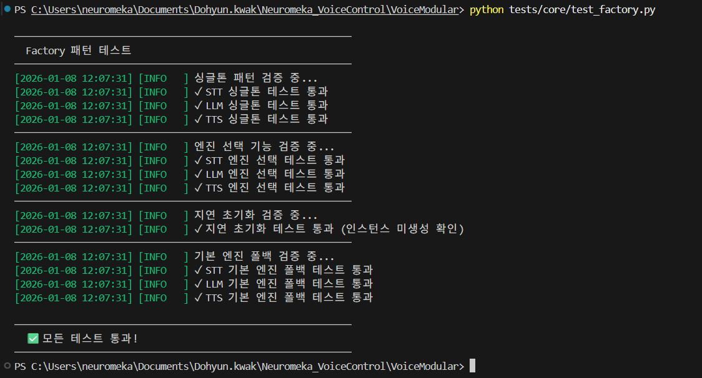
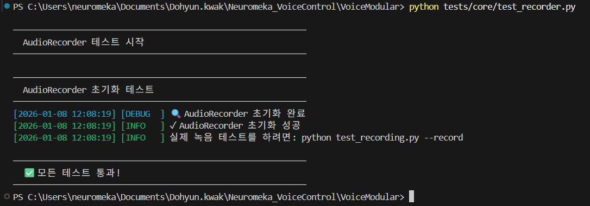
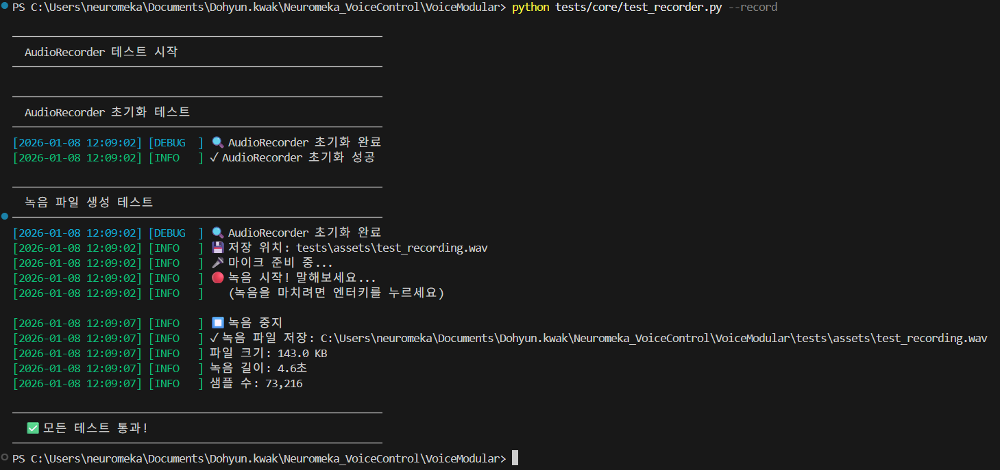
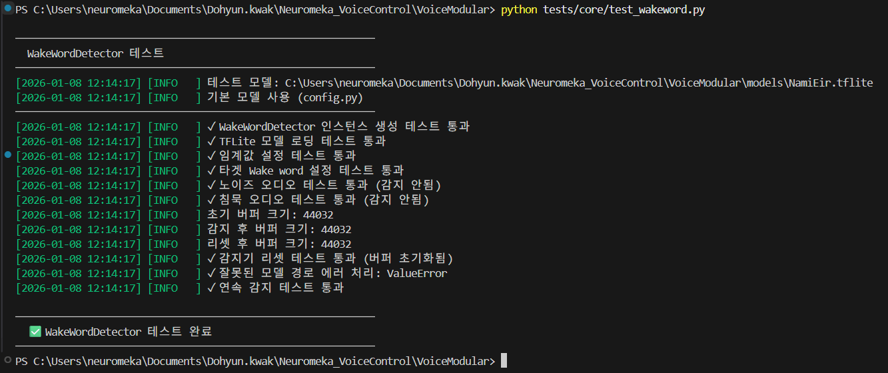
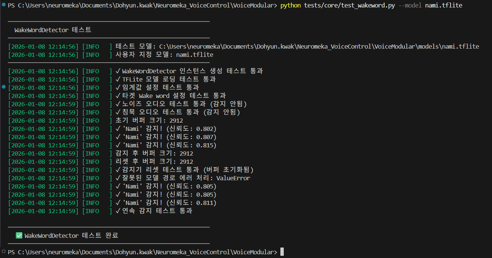

# 🧪 VoiceModular/core Test Suite

이 폴더는 시스템의 core 부분의 각 모듈이 정상적으로 작동하는지 확인하기 위한 테스트 스크립트를 포함합니다.

## 📋 테스트 전 준비사항
- 마이크와 스피커가 정상적으로 연결되어 있어야 합니다.
- `models/`에 유효한 TFlite 모델 파일이 있어야 합니다.
- 프로젝트 루트 또는 tests 폴더 어디서든 실행 가능합니다.

## 🔍 테스트 항목 및 실행 방법

### 1. core/factory.py 테스트
```bash
python test_factory.py
```


### 2. core/recorder.py 테스트
```bash
python test_recorder.py

# 녹음 테스트
python test_recorder.py --record
```




### 3. core/wakeword.py 테스트
```bash
python test_wakeword.py

# tflite 모델 변경
python test_wakeword.py --model "[file_name]"
# 예시 - python test_wakeword.py --model "nami.tflite"
```


