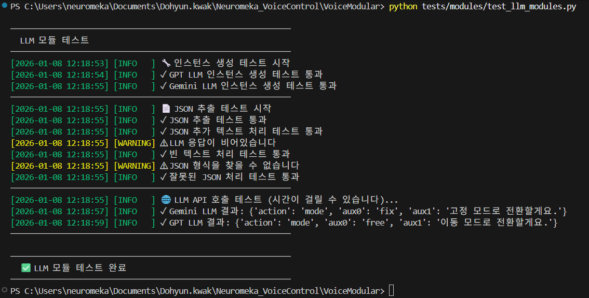
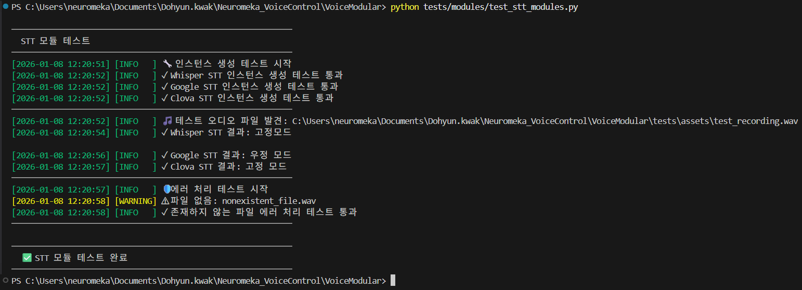
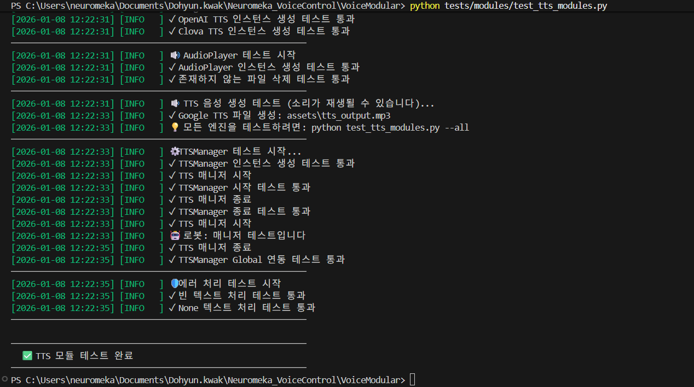
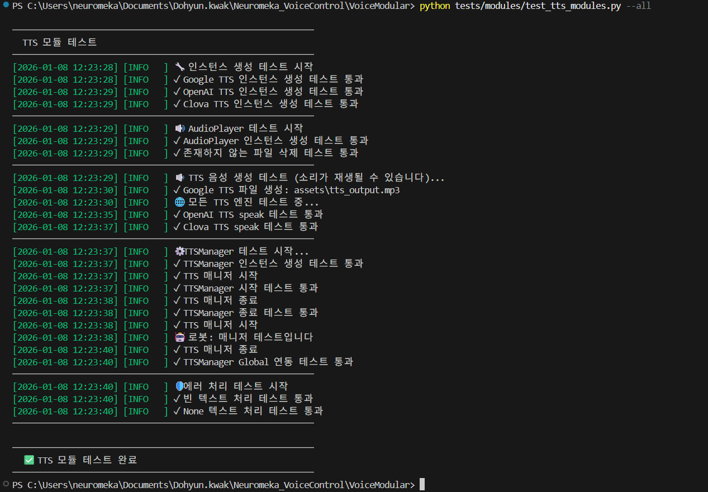

# 🧪 VoiceModular/modules Test Suite

이 폴더는 시스템의 modules 부분의 각 모듈이 정상적으로 작동하는지 확인하기 위한 테스트 스크립트를 포함합니다.

## 📋 테스트 전 준비사항
- 마이크와 스피커가 정상적으로 연결되어 있어야 합니다.
- `configs/`에 유효한 API 키가 설정되어 있어야 합니다.
- 프로젝트 루트 또는 tests 폴더 어디서든 실행 가능합니다.

## 🔍 테스트 항목 및 실행 방법

### 1. modules/llm_modules.py 테스트
```bash
python test_llm_modules.py
```


### 2. modules/stt_modules.py 테스트
```bash
python test_stt_modules.py
```


### 3. modules/tts_modules.py 테스트
```bash
python test_tts_modules.py

# 모든 tts 모델 테스트
python test_tts_modules.py --all
```


