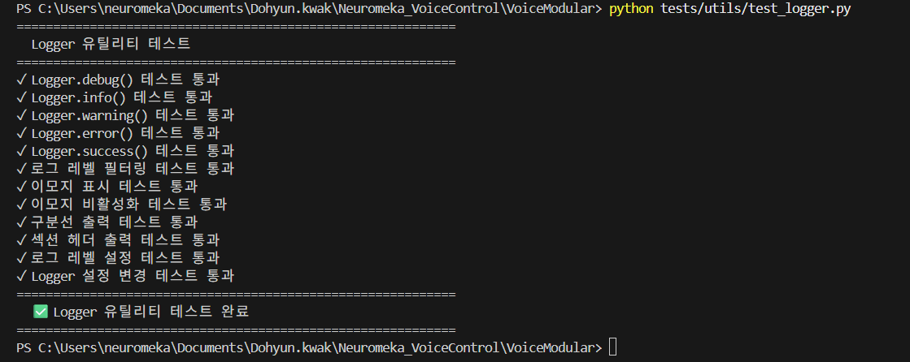
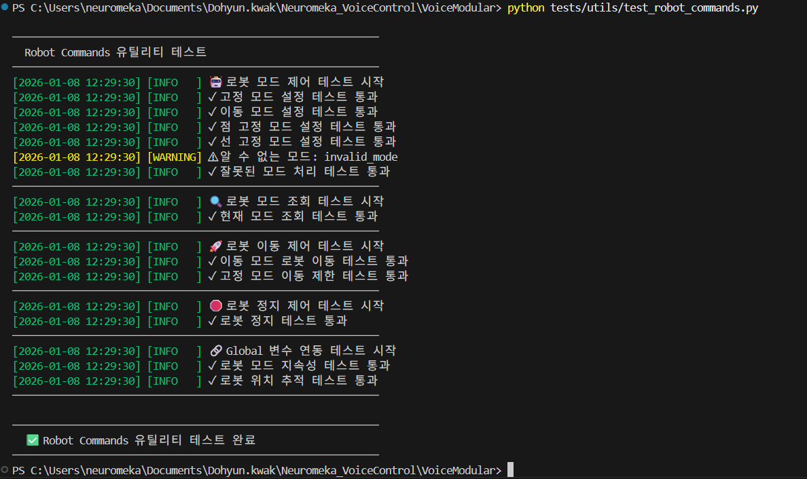

# 🧪 VoiceModular/utils Test Suite

이 폴더는 시스템의 utils 부분의 각 모듈이 정상적으로 작동하는지 확인하기 위한 테스트 스크립트를 포함합니다.

## 📋 테스트 전 준비사항
- 프로젝트 루트 또는 tests 폴더 어디서든 실행 가능합니다.

## 🔍 테스트 항목 및 실행 방법

### 1. utils/logger.py 테스트
```bash
python test_logger.py
```

> Log 테스트를 위해 print() 구문을 사용했기 때문에, 다른 테스트 파일과 출력 형식이 다릅니다

### 2. utils/robot_commands.py 테스트
```bash
python test_robot_commands.py
```
